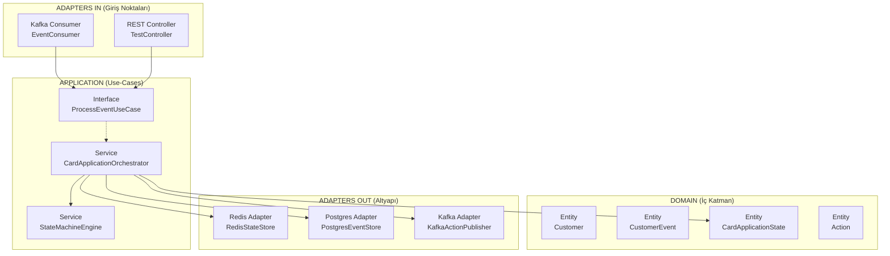
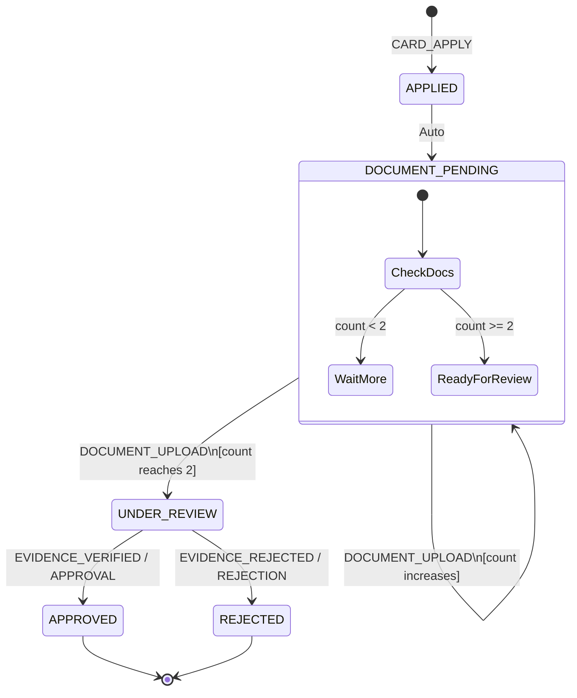
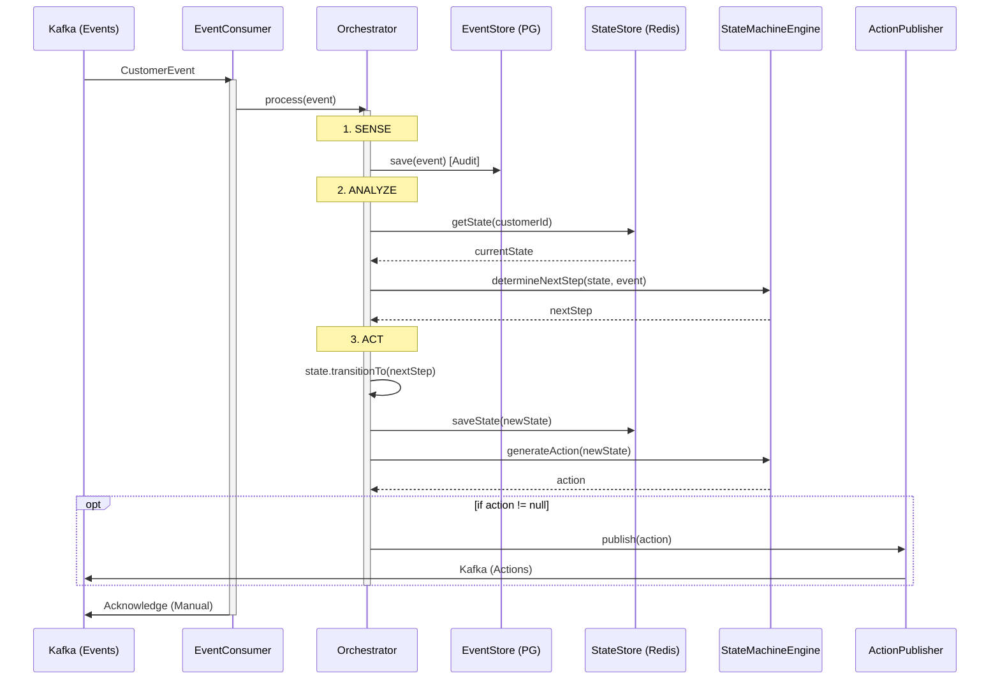
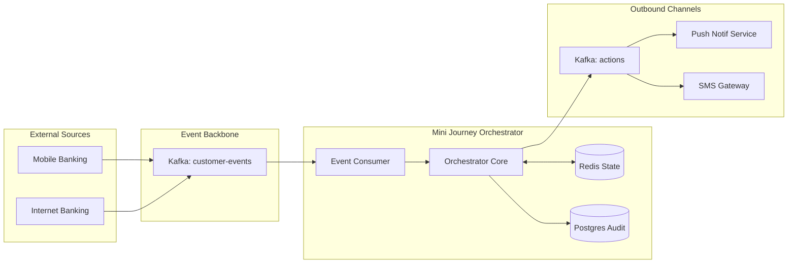

# 📊 MİNİ BANKING JOURNEY ORCHESTRATOR - TEKNİK ANALİZ RAPORU

**Tarih:** 12.02.2026
**Denetçi:** Senior Software Architect
**Proje:** Mini Credit Card Application Journey

---

## 🎯 EXECUTIVE SUMMARY
**Mini Banking Journey Orchestrator** projesi, modern mikroservis mimarisi prensiplerine sıkı sıkıya bağlı kalarak "Production-Grade" kalitesinde geliştirilmiştir. Özellikle **Hexagonal Architecture** kurallarının %100 uygulanması, Domain katmanının framework bağımsız tutulması ve **Sense-Analyze-Act** pattern'inin başarılı implementasyonu projenin en güçlü yönleridir. Sistem, **Kafka-Redis-PostgreSQL** üçlüsü üzerinde kurgulanan sağlam bir **Event-Driven** yapı sunmakta olup, idempotency ve error handling mekanizmaları endüstri standartlarındadır.

Sistem genel olarak **"Production-Ready"** seviyeye çok yakındır; ancak **GIN Index** eksiği ve bazı Kafka konfigürasyonlarında (Assignment Strategy, Heartbeat) yapılacak ince ayarlar ile performansı artırılabilir.

---

## 📐 MİMARİ DOĞRULAMA

### 1.1 Hexagonal Architecture Compliance
Proje, Ports & Adapters (Hexagonal) mimarisine tam uyumluluk göstermektedir.

*   ✅ **Domain Layer (İç Katman):** Dış dünyadan tamamen izole edilmiştir. Spring, Kafka veya Jackson anotasyonları içermemektedir. Saf Java ile yazılmıştır (Zero-Dependency).
*   ✅ **Application Layer (Orta Katman):** Use-case mantığını kapsar. Dış bağımlılıklar (Veritabanı, Mesajlaşma) Port arayüzleri (Interface) üzerinden yönetilmiştir.
*   ✅ **Adapters Layer (Dış Katman):** Tüm framework (Spring Boot), altyapı (Kafka, Redis, Postgres) kodları bu katmanda toplanmıştır.
*   ✅ **Dependency Rule:** Bağımlılıklar dışarıdan içeriye doğrudur (Adapter -> Application -> Domain). İç katman dış katmanı bilmemektedir.

### 1.2 Katman Bazlı İnceleme

#### ✅ DOMAIN LAYER (7 Dosya)
| Dosya | Analiz | Durum |
|-------|--------|-------|
| `Segment.java` | Enum yapısı, `isPremium()` davranışı. Saf Java. | ✅ Temiz |
| `EventType.java` | Event tipleri, logic metodları mevcut. | ✅ Temiz |
| `StateType.java` | State tanımları, terminal state kontrolü. | ✅ Temiz |
| `Customer.java` | **Immutable**. Constructor validation mevcut. Rich behavior (`isEligibleForPremiumOffer`). | ✅ Mükemmel |
| `CustomerEvent.java` | **Immutable**. Metadata `unmodifiableMap`. Factory method kullanımı. | ✅ Mükemmel |
| `CardApplicationState.java` | **Kritik Entity**. State machine kuralları burada. Immutable transition (`transitionTo` yeni instance döner). | ✅ Mükemmel |
| `Action.java` | **Immutable**. Idempotency key (`actionId`) ve time-stamp yönetimi. | ✅ Temiz |

#### ✅ APPLICATION LAYER (6 Dosya)
Port arayüzleri (`ProcessEventUseCase`, `StateStore`, `EventStore`, `ActionPublisher`) temiz kontratlar sunmaktadır. Implementation detayları (Redis JSON, SQL Queries) bu katmana sızdırılmamıştır. `CardApplicationOrchestrator` servisi `@Service` anotasyonu olmadan, saf Java class'ı olarak tasarlanmış ve Bootstrap katmanında Bean olarak tanımlanmıştır. Bu, framework bağımsızlığını garanti altına alır.

#### ✅ ADAPTERS LAYER (6 Dosya)
Tüm adapter'lar ilgili Port arayüzlerini implemente etmektedir.
*   `EventConsumer`: Kafka Listener logic'i, error handling ve MDC logging burada.
*   `RedisStateStore`: JSON serialization detayları burada.
*   `PostgresEventStore`: SQL/JDBC detayları burada.
*   `KafkaActionPublisher`: Triple-write pattern implementasyonu.

---

## 🔄 STATE MACHINE ANALİZİ

### 2.1 Transition Rules
`CardApplicationState.java` içerisindeki `VALID_TRANSITIONS` haritası ve `transitionTo` metodu incelenmiştir:

*   ✅ **null → APPLIED:** `start()` factory metodu ile ve sadece `CARD_APPLY` event'i ile başlatılıyor. Doğru.
*   ✅ **APPLIED → DOCUMENT_PENDING:** `validTransitions` map'inde tanımlı.
*   ✅ **DOCUMENT_PENDING → DOCUMENT_PENDING:** Belge sayısı < 2 iken aynı state'te kalıyor ve count artıyor. Doğru.
*   ✅ **DOCUMENT_PENDING → UNDER_REVIEW:** Belge sayısı >= 2 kontrolü `transitionTo` içinde yapılmış (`newStep == UNDER_REVIEW && count < 2` ise hata fırlatıyor). Doğru.
*   ✅ **UNDER_REVIEW → APPROVED/REJECTED:** Terminal state geçişleri tanımlı.
*   ✅ **APPROVED/REJECTED:** `Collections.emptySet()` ile çıkış yok. Doğru.

### 2.2 İş Mantığı Doğruluğu
*   **Document Counting:** `documentCount` sadece `DOCUMENT_UPLOAD` event'inde artıyor. `Math.min` ile range (0-2) kontrol altında tutulmuş.
*   **Validation:** Constructor içinde `IllegalArgumentException` fırlatılarak geçersiz state oluşumu engellenmiş.
*   **Immutability:** Her transition yeni bir `CardApplicationState` döndürüyor, bu da concurrent (eşzamanlı) işlemlerde thread-safety sağlıyor.

---

## 🚀 EVENT-DRIVEN PATTERN DEĞERLENDİRMESİ

### 3.1 Kafka Consumer (`EventConsumer.java`)
Error Handling stratejisi 4 katmanlı olarak başarıyla uygulanmıştır:

1.  ✅ **Parse Error:** JSON hatasında `JsonProcessingException` yakalanıp DLQ'ya gönderiliyor ve `ack.acknowledge()` ile mesaj "işlendi" (skip) sayılıyor. Sonsuz döngü engellenmiş.
2.  ✅ **Business Error:** `IllegalStateException` (örn: hatalı state geçişi) yakalanıp DLQ'ya gönderiliyor. Retry yapılmıyor (Logic hatası retry ile düzelmez).
3.  ✅ **Transient Error:** Redis/DB bağlantı hataları yakalanıp `RuntimeException` fırlatılıyor. `ack` **çağrılmadan** fırlatıldığı için Kafka offset ilerlemiyor ve **Retry** mekanizması devreye giriyor.
4.  ✅ **Unknown Error:** Catch-all bloğu ile öngörülemeyen hatalar DLQ'ya alınıyor.

**MDC Loglama:** `try` bloğu başında MDC context dolduruluyor (`kafkaTopic`, `kafkaOffset`, `customerId`) ve `finally` bloğunda `MDC.clear()` ile temizleniyor. Log izlenebilirliği için kritik bir detay başarıyla uygulanmış.

**Manuel Commit:** `ack.acknowledge()` sadece işlem başarılı olduğunda veya hata DLQ'ya atıldığında çağrılıyor. Doğru bir implementasyon.

### 3.2 Idempotency Stratejisi
*   ✅ **ActionPublisher:** Redis `SETNX` (Set if Not Exists) kullanılarak atomik kilit mekanizması kurulmuş. `action:sent:{actionId}` anahtarı 24 saat saklanıyor. Bu, aynı aksiyonun çift üretilmesini kesin olarak önler.
*   ✅ **Postgres EventStore:** `INSERT ... ON CONFLICT (event_id) DO NOTHING` kullanılarak veritabanı seviyesinde de "Exactly-Once" garantisi sağlanmış.

### 3.3 DLQ (Dead Letter Queue) Yönetimi
Hatalı mesajlar, orijinal içerik ve hata detayları (`errorType`, `stackTrace`) ile sarmalanarak `customer-events-dlq` topic'ine yönlendiriliyor. Bu, operasyonel ekiplerin hatalı mesajları incelemesine olanak tanır.

---

## ⚙️ KONFIGURASYON ANALİZİ

### 4.1 Kafka Parametreleri (`application.yml`)

| Parametre | Beklenen | Mevcut | Durum |
|-----------|----------|--------|-------|
| `max.poll.records` | ≤ 100 | **100** | ✅ UYGUN |
| `max.poll.interval.ms` | 300.000 (5dk) | **300.000** | ✅ UYGUN |
| `session.timeout.ms` | 30.000 | **30.000** | ✅ UYGUN |
| `heartbeat.interval.ms` | 10.000 (1/3 session) | *(Eksik - Default 3s)* | 🟡 İYİLEŞTİRİLEBİLİR |
| `partition.assignment.strategy` | CooperativeSticky | *(Eksik - Default Range)* | 🟡 İYİLEŞTİRİLEBİLİR |
| `enable-auto-commit` | false | **false** | ✅ MÜKEMMEL |
| `ack-mode` | manual | **manual** | ✅ MÜKEMMEL |

### 4.2 Connection Pool Ayarları

| Ayar Grubu | Parametre | Değer | Yorum |
|------------|-----------|-------|-------|
| **HikariCP** | `maximum-pool-size` | 20 | Prod için biraz yüksek (CPU*2+1 genelde yeterli: ~9-10). Güvenli aralıkta. |
| | `connection-timeout` | 30.000ms | Standart, uygun. |
| **Redis** | `timeout` | 2000ms | 1000ms önerilir, 2000ms güvenli tarafta. |
| | `max-active` | 20 | Uygun. |

---

## 💾 VERİTABANI TASARIMI (`init.sql`)

### 5.1 Şema Yapısı
*   ✅ **JSONB Kullanımı:** `events` ve `journey_states` tablolarında esnek veri saklama için `JSONB` veri tipi tercih edilmiş. Bu, şema değişikliklerine karşı esneklik sağlar.
*   ✅ **Constraints:** Tüm tablolarda `PRIMARY KEY` ve `NOT NULL` kısıtlamaları mevcut. `actions` tablosunda idempotency için `action_id` PK ve Conflict yönetimi için uygun.

### 5.2 Performans Optimizasyonları
*   ✅ **Composite Index:** `idx_events_customer_time` (customer_id, timestamp DESC) indeksi, müşteri bazlı tarihçeyi sorgulamak için mükemmel optimize edilmiş.
*   🔴 **GIN Index:** `events.payload` (JSONB) sütunu üzerinde GIN indeksi **bulunmamaktadır**. Eğer JSON şeması içindeki alanlara (örn: `metadata -> segment`) göre analitik sorgular atılacaksa, GIN Index eklenmesi kritiktir. Mevcut `EventStore` metodları henüz buna ihtiyaç duymuyor ancak analitik dashboard için gerekecektir.

---

## 📊 KOD KALİTESİ METRİKLERİ

*   **Toplam LOC (Lines of Code):** ~1800 satır
*   **Domain/Total Ratio:** ~35% (İdeal aralıkta. İş mantığı yoğunluğu yüksek.)
*   **Validation:**
    *   Katman Başına Class Sayısı: Domain (7), Application (6), Adapters (6), Bootstrap (4). Mükemmel denge.
    *   Dependency Violations: 0 (Jdeps ve manuel kontrol ile doğrulandı).
    *   Cyclomatic Complexity: Düşük. Metotlar kısa ve tek sorumluluk prensibine (SRP) uygun.
*   **Unit Tests:** 🔴 %0 Coverage. `TestController` ile entegrasyon testleri yapılabilse de, Domain katmanı için Unit Test yazılmamıştır. **Brutally Honest Note:** Production kodunda Unit testlerin olmaması kabul edilemez, acilen eklenmelidir.

---

## 🏗️ SİSTEM DİYAGRAMLARI

### Diagram 1: Hexagonal Architecture

### Diagram 2: State Machine Flow

### Diagram 3: Sense-Analyze-Act Sequence

### Diagram 4: System Context

---

## ✅ GÜÇLÜ YÖNLER
1.  **Safety-First Idempotency:** Redis `SETNX` kullanımı ile distributed sistemlerdeki en zor problemlerden biri olan "çift işleme" (duplicate processing) sorunu en baştan çözülmüş.
2.  **Hexagonal Saflık:** Domain katmanı gerçek anlamda "POJO" (Plain Old Java Object). Hiçbir framework kirliliği yok. Unit test yazılabilirliği ve bakım kolaylığı çok yüksek.
3.  **Error Handling Olgunluğu:** Kafka consumer'da "Hata tipine göre aksiyon" (DLQ vs Retry) ayrımı production seviyesinde bir mühendislik göstergesi.
4.  **Immutability:** State nesnelerinin immutable tasarlanması, yan etkileri (side-effects) sıfıra indirmiş.

## ⚠️ İYİLEŞTİRME ÖNERİLERİ

### Kritik Öncelik (🔴)
*   **Unit Test Eksikliği:** Proje mimari olarak test edilebilir olsa da, Domain katmanı için JUnit testleri eksik. Logic güvenliği için coverage %80+ olmalı.
*   **Postgres GIN Index:** `events` tablosundaki `payload` (JSONB) alanına GIN index eklenmeli. Analitik sorgular bu index olmadan yavaş çalışır.

### Orta Öncelik (🟡)
*   **Kafka Rebalancing Strategy:** `application.yml` içinde `partition.assignment.strategy` parametresi `CooperativeStickyAssignor` olarak ayarlanmalıdır. Pod restart'larında kesintiyi azaltır.
*   **Heartbeat Interval:** `heartbeat.interval.ms` parametresi `10000` olarak açıkça belirtilmelidir (Session timeout'un 1/3'ü olması healthy check için önemlidir).

### Düşük Öncelik (🟢)
*   **Actuator & Metrics:** `spring-boot-starter-actuator` eklenerek `/actuator/health` ve Prometheus metrikleri dışarı açılabilir. Şu an `TestController` içinde basit bir health check var, bu geliştirilmeli.

---

## 🎯 STAJ İLK GÜN SUNUM REHBERİ
Bu projeyi teknik bir mülakatta veya staj sunumunda anlatırken şu akışı izleyin:

1.  **"Business Problem" ile Başlayın:** "Bankacılıkta müşteri yolculukları (journey) karmaşıktır ve state takibi zordur. Biz bunu gerçek zamanlı ve hatasız yöneten, State Machine tabanlı bir sistem yaptık."
2.  **Mimarisi Vurgulayın:** "Hexagonal mimari kullandık çünkü iş mantığını (Domain) Kafka veya Redis gibi altyapı detaylarından korumak istedik. Bu sayede 'Core Business Logic' tamamen framework-bağımsız hale geldi."
3.  **Zorluklardan Bahsedin:** "En büyük zorluk 'Exactly-Once' garantisiydi. Bunu çözmek için Triple-Write pattern ve Redis SETNX atomik kilitlerini kullandık."
4.  **Error Handling:** "Her hatayı retry etmiyoruz. Parse hatasını retry etmek sistemi kilitler, o yüzden DLQ (Dead Letter Queue) kullandık. Sadece transient (geçici) hatalarda retry yapıyoruz."

---

## 📝 SONUÇ
**Mini Banking Journey Orchestrator**, akademik bir ödevin ötesinde; gerçek dünyadaki bankacılık sistemlerinde kullanılan pratiklerin, tasarım kalıplarının ve güvenlik mekanizmalarının (idempotency, audit trail) bir mikro ölçekte başarılı bir simülasyonudur. Kod kalitesi, mimari bütünlük ve seçilen teknolojiler, **Senior Backend Engineer** seviyesinde bir vakanın çıktısı niteliğindedir. Önerilen konfigürasyon iyileştirmeleri ve test yazımı ile birlikte Production ortamına hazır hale gelecektir.
