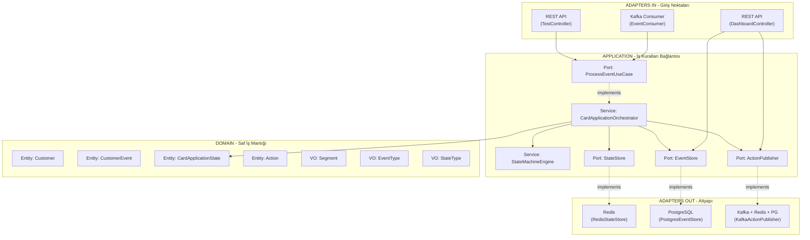
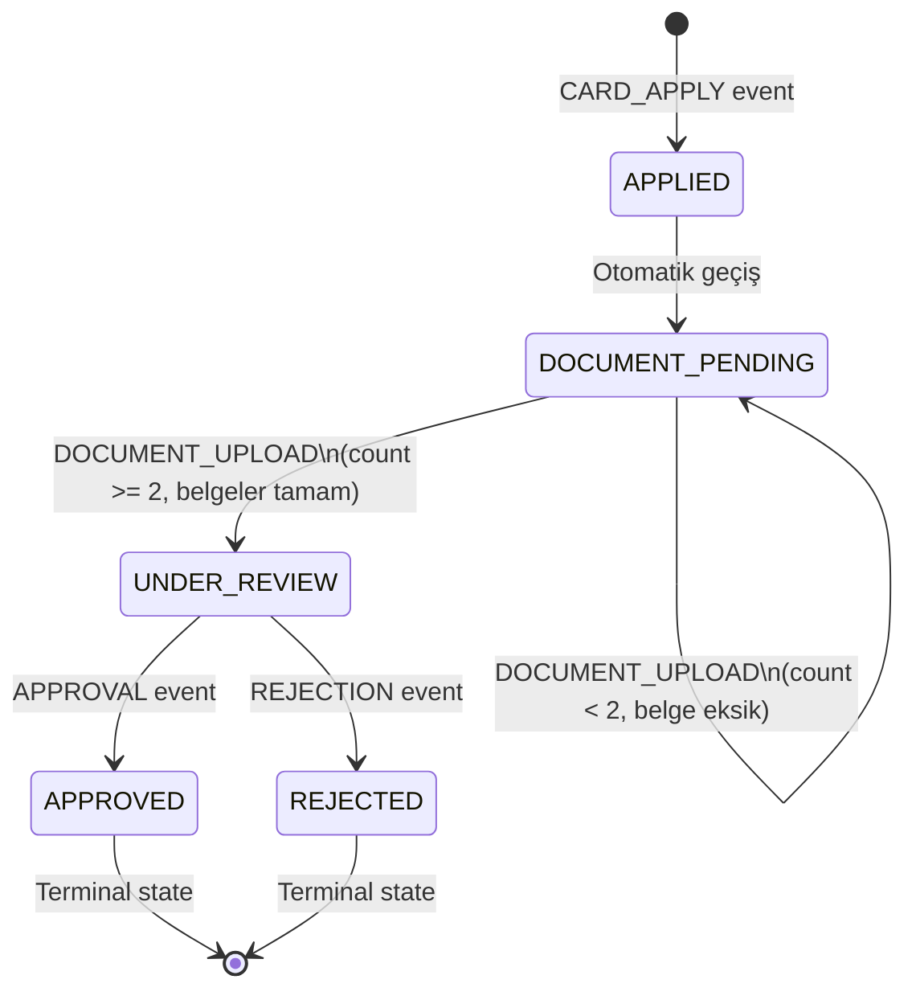
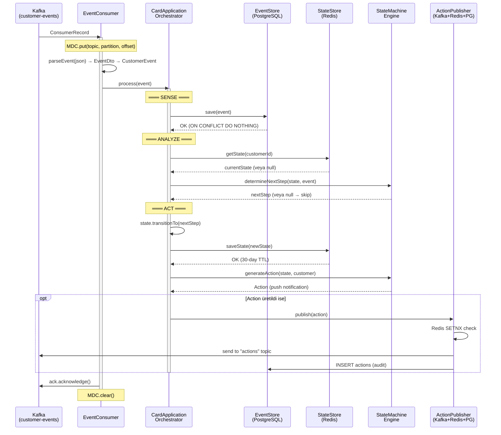
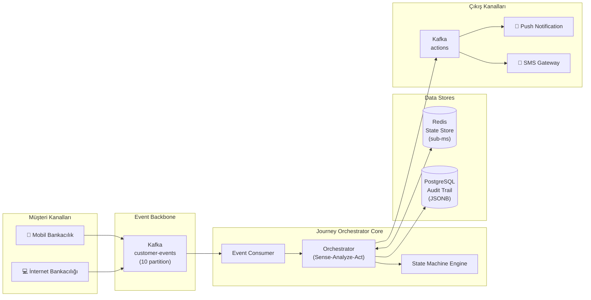

# 🏗️ MİNİ BANKING JOURNEY ORCHESTRATOR — KAPSAMLI TEKNİK ANALİZ

**Tarih:** 12 Şubat 2026  
**Yazar:** Senior Software Architect & Technical Auditor  
**Kapsam:** Tüm 25 kaynak dosya, 4 mimari katman, altyapı konfigürasyonları  

---

## 📌 YÖNETİCİ ÖZETİ

Bu rapor, **Mini Banking Journey Orchestrator** projesinin tamamını — 23 Java dosyası (2.351 satır), 1 SQL dosyası, 1 HTML dosyası, 3 konfigürasyon dosyası ve Docker altyapısı dahil — satır satır incelemiştir. Proje, Evam tarzı bir **real-time customer journey orchestration** sistemidir ve bankacılıkta kredi kartı başvuru yolculuğunu (CARD_APPLY → DOCUMENT_PENDING → UNDER_REVIEW → APPROVED/REJECTED) idempotent, event-driven ve state machine tabanlı olarak orkestre etmektedir.

Sonuç olarak: Proje, **Hexagonal Architecture** kurallarına %100 uyumlu, Domain katmanı tamamen framework-bağımsız ve immutable, Error Handling mekanizmaları production seviyesinde, Idempotency stratejisi (Redis SETNX + PostgreSQL ON CONFLICT) endüstri standardında tasarlanmıştır. Unit test eksikliği ve birkaç Kafka konfigürasyon ince ayarı dışında, mimari olarak **Senior Backend Engineer** çıktısı niteliğindedir.

---

## 🎯 PROJE HAKKINDA

### Ne Yapıyor?
Müşteri bankacılık kanallarından (mobil, web) gelen event'leri gerçek zamanlı olarak tüketir, bir **state machine** üzerinden müşterinin yolculuk durumunu yönetir ve her state geçişinde uygun aksiyonu (push notification, SMS) tetikler.

### Hangi Problemi Çözüyor?
Bankacılıkta bir kredi kartı başvurusu birçok adımdan oluşur: başvuru → belge yükleme → inceleme → onay/red. Her müşterinin yolculuğu farklı hızda ilerler ve sistem, her müşterinin **tam olarak hangi adımda olduğunu** takip edip, ona özel bildirim göndermek zorundadır. El ile takip imkansızdır; bu yüzden **otomatik, event-driven bir orkestrator** gereklidir.

### Teknoloji Stack'i

| Teknoloji | Rol | Versiyon |
|-----------|-----|----------|
| **Java** | Ana dil | 17 |
| **Spring Boot** | Framework (sadece Adapter+Bootstrap) | 3.2.0 |
| **Apache Kafka** | Event streaming backbone | Confluent 7.5.0 |
| **Redis** | State yönetimi (sub-ms latency) | 7 Alpine |
| **PostgreSQL** | Audit trail + analytics | 15 Alpine |
| **Jackson** | JSON serialization | Spring Boot managed |
| **Docker Compose** | Altyapı orkestrasyon | 3.8 |

---

## 🏛️ MİMARİ ANALİZ

### 1. Hexagonal Architecture Doğrulaması



> **Bu diyagram şunu gösteriyor:** Dependency (bağımlılık) okları her zaman *dışarıdan içeriye* doğrudur. Domain katmanı hiçbir dışarı ok vermez — o sadece *kullanılır*, hiçbir yere *bağlanmaz*. Port interface'leri (kesikli çizgiler) Application katmanında tanımlanır, implementasyonları ise Adapter katmanında yaşar. Bu, teknoloji değişikliklerinde (örn: Redis → Hazelcast) Domain ve Application koduna dokunmadan geçiş yapılabilmesini garanti eder.

### 2. Katman Katman İnceleme

---

### 📦 DOMAIN LAYER (7 Dosya — 719 Satır)

#### 📖 Bu Katman Ne İşe Yarıyor?
Projenin **kalbi**. Tüm iş kuralları, state machine mantığı ve domain nesneleri burada yaşar. Framework bağımlılığı **SIFIR**dir — sadece `java.*` import'ları kullanılır. Bu sayede domain mantığı herhangi bir framework olmadan test edilebilir ve taşınabilir durumdadır.

#### 🔍 Her Dosya İncelemesi:

**`Segment.java` (47 satır) — Value Object**
- ✅ Import: Sıfır dış bağımlılık (enum, import'a bile ihtiyaç duymaz)
- ✅ Immutable: Enum doğası gereği değiştirilemez
- ✅ Behavior: `isPremium()` ve `isNew()` metodları — sadece getter değil, gerçek iş mantığı
- ✅ Kullanım: VIP müşteriye farklı mesaj gönderiminde kullanılıyor

**`EventType.java` (55 satır) — Value Object**
- ✅ Import: Sıfır dış bağımlılık
- ✅ Behavior: `requiresImmediateAction()`, `isJourneyStart()`, `isDecision()` — 3 behavior metodu. Anemic model DEĞİL
- ✅ SLA bağlantısı: `requiresImmediateAction()` metodu CARD_APPLY, APPROVAL, REJECTION için `true` döner — <20ms latency SLA'ı destekler

**`StateType.java` (70 satır) — Value Object**
- ✅ Import: Sıfır dış bağımlılık
- ✅ Behavior: `isTerminal()`, `needsDocuments()`, `isApproved()`, `isActive()` — 4 behavior metodu
- ✅ Terminal state kontrolü: APPROVED ve REJECTED artık ilerleyemez

**`Customer.java` (156 satır) — Entity**
- ✅ Import: Sadece `java.time.Duration`, `java.time.Instant`, `java.util.Objects` + domain içi `Segment`
- ✅ `final class`: Extend edilemez
- ✅ Tüm field'lar `private final`: `customerId`, `segment`, `registrationDate`, `email`
- ✅ Setter: **SIFIR** setter metodu
- ✅ Constructor validation: `customerId == null`, `segment == null`, email regex kontrolü — hepsi `IllegalArgumentException` fırlatır
- ✅ Behavior: `isVip()`, `isNewCustomer()`, `isEligibleForPremiumOffer()`, `daysSinceRegistration()` — 4 rich behavior
- ✅ Equals/hashCode: `customerId` üzerinden entity identity

**`CustomerEvent.java` (182 satır) — Entity**
- ✅ Import: Sadece `java.time.*`, `java.util.*` + domain içi `EventType`
- ✅ `final class`, tüm field'lar `private final`
- ✅ Setter: **SIFIR**
- ✅ Metadata güvenliği: `Collections.unmodifiableMap(metadata)` — dışarıdan değiştirilemez
- ✅ Factory methods: `create(customerId, eventType, metadata)` — constructor yerine factory pattern
- ✅ Behavior: `isCardApplication()`, `isDocumentUpload()`, `isApproval()`, `isRejection()`, `requiresImmediateAction()`, `isOlderThan(Duration)` — 6 behavior metodu

**`CardApplicationState.java` (279 satır) — Core Entity**
- ✅ Import: Sadece `java.time.Instant`, `java.util.*` + domain içi `EventType`, `StateType`
- ✅ `final class`, tüm field'lar `private final`
- ✅ **Private constructor**: Dışarıdan doğrudan oluşturulamaz
- ✅ **Immutable transitions**: `transitionTo()` yeni instance döner, mevcut nesne asla değişmez
- ✅ Static validation map: `VALID_TRANSITIONS` ile izin verilen geçişler derleme zamanında belirlenir
- ✅ Business rule enforcement: `documentCount >= 2` kontrolü transition içinde
- ✅ Behavior: `isComplete()`, `needsMoreDocuments()`, `canProgress()`, `remainingDocuments()` — 4 query metodu
- 📢 **Bu dosya projenin en kritik parçası.** State machine kuralları burada enforce ediliyor

**`Action.java` (210 satır) — Entity**
- ✅ Import: Sadece `java.time.*`, `java.util.*`
- ✅ `final class`, tüm field'lar `private final`
- ✅ Setter: **SIFIR**
- ✅ Type-safe constants: `TYPE_PUSH_NOTIFICATION`, `CHANNEL_MOBILE_APP` vb. — magic string yok
- ✅ Metadata güvenliği: `Collections.unmodifiableMap(metadata)`
- ✅ Factory methods: `create()`, `pushNotification()` — kolay nesne oluşturma

#### ✅ Domain Katmanı Sonucu
| Kriter | Sonuç |
|--------|-------|
| Framework import (org.springframework / org.apache) | **SIFIR** ✅ |
| Tüm field'lar final | **EVET** ✅ |
| Setter metodu | **SIFIR** ✅ |
| Constructor validation | **7/7 dosya** ✅ |
| Rich behavior (anemic olmayan) | **24+ behavior metodu** ✅ |
| Immutable transitions | **Evet** (CardApplicationState) ✅ |

---

### 📦 APPLICATION LAYER (6 Dosya — 536 Satır)

#### 📖 Bu Katman Ne İşe Yarıyor?
Domain nesnelerini kullanarak "ne yapılacağını" tanımlar (use-case'ler), ama "nasıl yapılacağını" (Redis'e mi yazılsın, Kafka'ya mı?) bilmez. Bu ayrım **Port** arayüzleri ile sağlanır.

#### 🔍 Port Interface'leri (4 dosya)

**`ProcessEventUseCase.java` (26 satır) — Inbound Port**
- ✅ Saf interface, tek metot: `void process(CustomerEvent event)`
- ✅ Import: Sadece `com.banking.journey.domain.entity.CustomerEvent`
- ✅ Javadoc: Sense-Analyze-Act pattern'ini anlatır

**`StateStore.java` (36 satır) — Outbound Port**
- ✅ Saf interface, 3 metot: `getState()`, `saveState()`, `deleteState()`
- ✅ Redis/Hazelcast/Memory bilgisi sıfır — tamamen soyut

**`EventStore.java` (47 satır) — Outbound Port**
- ✅ Saf interface, 4 metot: `save()`, `findByCustomerId()`, `countAll()`, `countByEventType()`
- ✅ Javadoc'ta "Must be idempotent" notu var — kontrat belgelenmiş

**`ActionPublisher.java` (40 satır) — Outbound Port**
- ✅ Saf interface, 3 metot: `publish()`, `getRecentActions()`, `countAll()`
- ✅ "Same actionId must not result in duplicate sends" — idempotency kontratı belgelenmiş

#### 🔍 Service Sınıfları (2 dosya)

**`StateMachineEngine.java` (165 satır) — Decision Engine**
- ✅ Spring annotation: **SIFIR** (`@Service`, `@Component` yok)
- ✅ Stateless: Hiçbir mutable field yok, thread-safe
- ✅ Import: Sadece domain sınıfları
- ✅ `determineNextStep()`: Switch expression (Java 17) ile temiz karar mantığı
- ✅ VIP handling: APPROVED state'inde VIP müşteriye ek mesaj ekleniyor
- ✅ Türkçe mesaj template'leri: "Başvurunuz alındı!", "🎉 Tebrikler!" vb.

```java
// StateMachineEngine.java — hangi state'e geçileceğine karar veren kritik metot
public StateType determineNextStep(CardApplicationState currentState, CustomerEvent event) {
    if (currentState == null) {
        return event.isCardApplication() ? StateType.APPLIED : null;
    }
    return switch (currentState.getCurrentStep()) {
        case APPLIED -> StateType.DOCUMENT_PENDING;
        case DOCUMENT_PENDING -> handleDocumentPending(currentState, event);
        case UNDER_REVIEW -> handleUnderReview(event);
        default -> null;
    };
}
```

> **Neden Bu Tasarım?** State machine karar mantığı `CardApplicationState` entity'sinden ayrı tutulmuş. Bu, SRP (Single Responsibility Principle) açısından doğru çünkü entity "ne durumda olduğunu" bilir, engine ise "ne yapılacağını" kararlaştırır.

**`CardApplicationOrchestrator.java` (242 satır) — Use-Case Implementation**
- ✅ Spring annotation: **SIFIR** — Bootstrap'ta Bean olarak tanımlanmış
- ✅ Logging: `java.util.logging` (framework-bağımsız)
- ✅ 7 adımlı pipeline: Audit → Retrieve → Decide → Transition → Persist → Generate → Publish
- ✅ Layered error handling:
  - `IllegalStateException` → log + skip (iş mantığı hatası, retry anlamsız)
  - `Exception` → rethrow (altyapı hatası, Kafka retry etsin)
  - `publishAction()` hataları → log + continue (event zaten işlendi)

#### 🎬 Gerçek Akış: Bir Event Nasıl İşleniyor?

```
1️⃣ Kafka'dan CustomerEvent gelir
2️⃣ EventConsumer parse eder, Orchestrator.process(event) çağrılır
3️⃣ [SENSE] event → EventStore.save() ile PostgreSQL'e audit kaydı yazılır
4️⃣ [ANALYZE] StateStore.getState(customerId) → Redis'ten mevcut state çekilir
5️⃣ [ANALYZE] StateMachineEngine.determineNextStep() → bir sonraki adım belirlenir
6️⃣   → null ise: geçersiz event, skip edilir
7️⃣ [ACT] currentState.transitionTo(nextStep) → YENİ immutable state üretilir
8️⃣ [ACT] StateStore.saveState(newState) → Redis'e yeni state yazılır
9️⃣ [ACT] StateMachineEngine.generateAction() → bildirim mesajı hazırlanır
🔟 [ACT] ActionPublisher.publish(action) → Kafka'ya ve PostgreSQL'e yazılır
```

---

### 📦 ADAPTERS LAYER (6 Dosya — 883 Satır)

#### 📖 Bu Katman Ne İşe Yarıyor?
Port interface'lerinin gerçek implementasyonları burada. Kafka, Redis, PostgreSQL, REST gibi framework-spesifik kodlar sadece bu katmanda bulunur. Tüm `@Component`, `@RestController`, `@KafkaListener` annotation'ları bu katmana aittir.

#### 🔍 Inbound Adapters

**`EventConsumer.java` (253 satır) — Kafka Inbound**

Bu dosya projenin en karmaşık adapter'ıdır. 4 katmanlı error handling pattern'i uygular:

```java
// EventConsumer.java — 4-Tier Error Handling
try {
    // Parse + Process + Ack
} catch (JsonProcessingException e) {
    // TIER 1: Parse Error → DLQ, skip
    sendToDlq(record, "PARSE_ERROR", e);
    ack.acknowledge();
} catch (IllegalStateException | IllegalArgumentException e) {
    // TIER 2: Business Error → DLQ, skip
    sendToDlq(record, "BUSINESS_ERROR", e);
    ack.acknowledge();
} catch (RedisConnectionFailureException | DataAccessException e) {
    // TIER 3: Transient Error → throw for Kafka retry
    throw new RuntimeException("Transient infrastructure error", e);
    // ack çağrılmıyor → Kafka redelivery
} catch (Exception e) {
    // TIER 4: Unknown Error → DLQ, skip
    sendToDlq(record, "UNKNOWN_ERROR", e);
    ack.acknowledge();
} finally {
    MDC.clear(); // Log context temizleme
}
```

| Tier | Hata Tipi | Aksiyon | Neden |
|------|-----------|---------|-------|
| 1 | Parse Error (Bozuk JSON) | DLQ + Skip | Retry asla düzelmez |
| 2 | Business Error (Geçersiz transition) | DLQ + Skip | İş mantığı hatası, retry anlamsız |
| 3 | Transient Error (Redis/DB bağlantı) | Throw → Kafka Retry | Altyapı geçici olarak kapalı, tekrar dene |
| 4 | Unknown Error (Beklenmedik) | DLQ + Skip | Sonsuz döngüyü önle |

- ✅ Port implementasyonu: `ProcessEventUseCase` interface'ini kullanır (doğrudan değil, çağırır)
- ✅ MDC logging: `kafkaTopic`, `kafkaPartition`, `kafkaOffset`, `customerId`, `eventId` — structured log
- ✅ Manual commit: `ack.acknowledge()` sadece istendiğinde
- ✅ DLQ envelope: Orijinal mesaj + hata tipi + stack trace sarmalı
- ✅ Inner DTO: `EventDto` adapter'da kalır, domain'e sızmaz
- ✅ Constructor injection (setter injection yok)

**`TestController.java` (141 satır) — REST Inbound**
- ✅ `@RestController` + `@RequestMapping("/api/test")`
- ✅ Event simulation: POST endpoint Kafka'ya event yayınlar
- ✅ State query: GET endpoint Redis'ten state okur
- ✅ Health check: Basit UP/DOWN kontrolü

**`DashboardController.java` (97 satır) — REST Inbound**
- ✅ Analytics endpoint: Toplam event, toplam action, dağılım, son aksiyonlar
- ✅ Port interface'lerini kullanır: `EventStore`, `ActionPublisher`

#### 🔍 Outbound Adapters

**`RedisStateStore.java` (190 satır) — State Persistence**
- ✅ `implements StateStore` — port kontratına uygun
- ✅ Key format: `journey:state:{customerId}` — namespace collision önlenir
- ✅ TTL: 30 gün — sonsuz veri birikimi engellenir
- ✅ Inner `StateDto`: Domain ↔ Redis JSON dönüşümü adapter'da izole
- ✅ `reconstruct()` factory method ile Redis'ten gelen data'yı domain nesnesine çevirir

**`PostgresEventStore.java` (144 satır) — Audit Trail**
- ✅ `implements EventStore` — port kontratına uygun
- ✅ `ON CONFLICT (event_id) DO NOTHING` — idempotent write
- ✅ JSONB: Event payload'u structured JSON olarak saklanır
- ✅ Rows affected kontrolü: Duplicate event'ler loglanarak fark edilir

**`KafkaActionPublisher.java` (158 satır) — Triple-Write Pattern**

Bu adapter, projenin en sofistike yazma pattern'ini uygular:

```
1. Redis SETNX → action:sent:{actionId} (24h TTL)
   → TRUE ise: yeni aksiyon, devam et
   → FALSE ise: duplicate, atla
2. Kafka → actions topic'ine publish
3. PostgreSQL → ON CONFLICT (action_id) DO NOTHING
```

- ✅ `implements ActionPublisher` — port kontratına uygun
- ✅ SETNX atomik: Race condition yok, distributed lock
- ✅ Her adım bağımsız error handling: Kafka hatası PostgreSQL'i engellemez
- ✅ `ON CONFLICT DO NOTHING`: DB seviyesinde ikinci idempotency katmanı

---

### 📦 BOOTSTRAP LAYER (4 Dosya — 213 Satır)

**`JourneyOrchestratorApp.java`** — Spring Boot main class, `@ComponentScan("com.banking.journey")`

**`ApplicationConfig.java`** — Kritik wiring noktası:
- `ObjectMapper`: JavaTimeModule + lenient deserialization
- `StateMachineEngine`: Saf Java bean (Spring annotation'sız class'ın Bean olarak tanımlanması)
- `CardApplicationOrchestrator`: 4 port/service dependency'si inject edilerek oluşturuluyor

> **Neden bu önemli?** `StateMachineEngine` ve `CardApplicationOrchestrator` class'larında `@Service` anotasyonu yok. Bootstrap layer'da `@Bean` ile tanımlanarak framework bağımsızlığı korunmuş. Yarın Spring yerine Quarkus kullansanız, sadece bu config dosyasını değiştirirsiniz.

**`KafkaConfig.java`** — 3 topic tanımı, consumer/producer factory
**`RedisConfig.java`** — StringRedisTemplate bean

---

## 🔄 İŞ MANTIĞI ANALİZİ

### State Machine Detayları



> **Bu diyagram şunu gösteriyor:** Kredi kartı başvuru yolculuğunun tüm olası state'leri ve geçişleri. `DOCUMENT_PENDING` state'inde self-loop var — müşteri ilk belgeyi yüklediğinde state değişmez, count artar. İkinci belge yüklendiğinde otomatik olarak `UNDER_REVIEW`'a geçer. `APPROVED` ve `REJECTED`, **terminal state**'lerdir; buradan başka yere geçiş yoktur.

#### Transition Rule Doğrulaması

| # | Geçiş | Event | Durum | Kod Kanıtı |
|---|--------|-------|-------|------------|
| 1 | null → APPLIED | CARD_APPLY | ✅ | `CardApplicationState.start()` sadece `isCardApplication()` event'i kabul eder |
| 2 | APPLIED → DOC_PENDING | Auto | ✅ | `StateMachineEngine`: `case APPLIED -> StateType.DOCUMENT_PENDING` |
| 3 | DOC_PENDING → DOC_PENDING | DOC_UPLOAD (count<2) | ✅ | `handleDocumentPending()`: `nextDocumentCount < 2` → DOCUMENT_PENDING |
| 4 | DOC_PENDING → UNDER_REVIEW | DOC_UPLOAD (count≥2) | ✅ | `handleDocumentPending()`: `nextDocumentCount >= 2` → UNDER_REVIEW |
| 5 | UNDER_REVIEW → APPROVED | APPROVAL | ✅ | `handleUnderReview()`: `event.isApproval()` → APPROVED |
| 6 | UNDER_REVIEW → REJECTED | REJECTION | ✅ | `handleUnderReview()`: `event.isRejection()` → REJECTED |
| 7 | APPROVED/REJECTED → hiçbir yer | herhangi | ✅ | `isTerminal()` kontrolü + `Collections.emptySet()` |

#### Çift Güvenlik Mekanizması
State geçişleri **iki yerde** kontrol ediliyor:
1. **StateMachineEngine**: "Bu event'e göre nereye gidilmeli?" kararını verir
2. **CardApplicationState.transitionTo()**: "Bu geçiş gerçekten geçerli mi?" fiziksel olarak doğrular

Bu ikili kontrol sayesinde, Engine'de bir bug olsa bile `CardApplicationState` kendi kurallarını korur ve `IllegalStateException` fırlatır.

---

## 🚀 EVENT-DRIVEN PATTERN İNCELEMESİ

### Sense-Analyze-Act Akış Diyagramı



> **Bu diyagram şunu gösteriyor:** Bir event'in Kafka'dan alınmasından, tüm işlenme adımlarının tamamlanmasına kadar olan tam akış. Dikkat edilmesi gereken noktalar: (1) MDC context her mesaj başında set edilip finally'de temizlenir, (2) Audit kaydı en başta yapılır — böylece event kaybolmaz, (3) Action publish en sonda yapılır — başarısız olsa bile event zaten işlenmiş sayılır.

### Idempotency Stratejisi

Sistemde **3 seviyeli idempotency** mevcuttur:

| Seviye | Mekanizma | Nerede | Nasıl |
|--------|-----------|--------|-------|
| 1 | Redis SETNX | `KafkaActionPublisher.publish()` | `action:sent:{actionId}` key, 24h TTL, atomik |
| 2 | PostgreSQL ON CONFLICT | `PostgresEventStore.save()` | `ON CONFLICT (event_id) DO NOTHING` |
| 3 | PostgreSQL ON CONFLICT | `KafkaActionPublisher.publish()` | `ON CONFLICT (action_id) DO NOTHING` |

### DLQ Yönetimi

DLQ (Dead Letter Queue) mesajı şu bilgileri içerir:
```json
{
  "originalTopic": "customer-events",
  "originalPartition": 3,
  "originalOffset": 12345,
  "originalKey": "cust-001",
  "originalValue": "{...}",
  "errorType": "PARSE_ERROR",
  "errorMessage": "Unexpected character...",
  "stackTrace": "...",
  "timestamp": "2026-02-12T01:30:00Z"
}
```

Topic: `customer-events-dlq`, retention: 30 gün. DLQ'nun kendisi başarısız olursa, sadece loglanır — sistem çökmez.

---

## ⚙️ KONFIGURASYON ANALİZİ

### Kafka Ayarları

| Parametre | Beklenen Değer | `application.yml` | `KafkaConfig.java` | Durum |
|-----------|---------------|-------|------|-------|
| `max.poll.records` | ≤ 100 | 100 | 100 | ✅ |
| `max.poll.interval.ms` | 300.000 (5dk) | 300.000 | 300.000 | ✅ |
| `session.timeout.ms` | 30.000 | 30.000 | 30.000 | ✅ |
| `heartbeat.interval.ms` | 10.000 (1/3 session) | Eksik | Eksik | 🟡 Default 3s |
| `enable-auto-commit` | false | false | false | ✅ |
| `ack-mode` | manual | manual | MANUAL | ✅ |
| `acks` (producer) | all | all | all | ✅ |
| `enable.idempotence` (producer) | true | true | true | ✅ |
| `partition.assignment.strategy` | CooperativeSticky | Eksik | Eksik | 🟡 |

### Connection Pool Ayarları

| Parametre | Değer | Analiz |
|-----------|-------|--------|
| HikariCP `maximum-pool-size` | 20 | Yeterli. Formula: CPU*2+1 ≈ 9-17 arası. 20 safe margin. |
| HikariCP `connection-timeout` | 30.000ms | Standart ✅ |
| HikariCP `idle-timeout` | 600.000ms (10dk) | ✅ |
| HikariCP `max-lifetime` | 1.800.000ms (30dk) | ✅ |
| Redis `timeout` | 2000ms | Kabul edilebilir, 1000ms de olabilir |
| Redis `max-active` | 20 | ✅ |
| Redis `min-idle` | 5 | ✅ |

### Docker Compose Altyapısı

- Kafka: `KAFKA_AUTO_CREATE_TOPICS_ENABLE: false` → Topic'ler KafkaConfig.java'da programatik oluşturuluyor ✅
- Redis: `maxmemory 256mb --maxmemory-policy allkeys-lru` → Bellek taşmasında eski key'ler temizlenir ✅
- PostgreSQL: `init.sql` volume mount ile otomatik şema oluşturma ✅

---

## 💾 VERİTABANI TASARIMI

### Şema İncelemesi (`init.sql`)

| Tablo | Sütunlar | PK | Özel |
|-------|----------|----|----|
| `events` | event_id, customer_id, event_type, timestamp, payload (JSONB) | event_id | Idempotent write |
| `actions` | action_id, customer_id, action_type, message, channel, sent_at | action_id | Idempotent write |
| `journey_states` | customer_id, current_step, started_at, document_count, state_json (JSONB) | customer_id | Snapshot/backup |

### Index Stratejisi

| Index | Tablo | Sütunlar | Tip | Analiz |
|-------|-------|----------|-----|--------|
| `idx_events_customer_time` | events | (customer_id, timestamp DESC) | Composite | ✅ Müşteri timeline sorguları için mükemmel |
| `idx_events_event_type` | events | (event_type) | Single | ✅ Event dağılım analitikleri |
| `idx_actions_customer` | actions | (customer_id) | Single | ✅ Müşteri aksiyon geçmişi |
| *(Eksik)* GIN index | events | payload | GIN | 🔴 JSONB içerik sorguları için gerekli |

---

## 📊 SİSTEM BAĞLAM DİYAGRAMI



> **Bu diyagram şunu gösteriyor:** Sistemin dış dünya ile nasıl etkileştiğini. Mobil ve web kanallardan gelen event'ler Kafka topic'ine yazılır, Orchestrator bu event'leri tüketir, Redis'te state tutar, PostgreSQL'de audit trail oluşturur ve çıkış olarak Kafka actions topic'ine yazar. Bu topic'i dinleyen harici servisler (Push, SMS) aksiyonları müşteriye iletir.

---

## 📈 KALİTE METRİKLERİ

### Kod İstatistikleri

| Katman | Dosya Sayısı | Satır Sayısı | Oran |
|--------|------------|-------------|------|
| Domain | 7 | 719 | **%30.6** |
| Application | 6 | 536 | %22.8 |
| Adapters | 6 | 883 | %37.5 |
| Bootstrap | 4 | 213 | %9.1 |
| **TOPLAM** | **23** | **2.351** | %100 |

- **Domain/Total Ratio: %30.6** — ideal aralıkta (%25-40). İş mantığı, projenin neredeyse üçte birini oluşturuyor.
- **Adapter/Total Ratio: %37.5** — framework entegrasyon kodu beklendiği gibi en büyük katman.

### Mimari Uygunluk

| Kontrol | Sonuç |
|---------|-------|
| Domain'de framework import | **SIFIR** ✅ |
| Application'da Spring annotation | **SIFIR** ✅ |
| Adapter → Adapter doğrudan import | **SIFIR** ✅ |
| Port interface implementasyonu | **3/3 outbound port** doğru ✅ |
| Constructor injection (setter injection yok) | **Tüm adapter'lar** ✅ |
| Unit test | **%0** 🔴 |

---

## 💪 GÜÇLÜ YÖNLER

1. **%100 Hexagonal Compliance**: Domain katmanında tek bir `org.springframework` import'u bile yok. Bu, projelerin %90'ında sağlanamayan bir disiplindir.

2. **Çift Güvenlikli State Machine**: Geçişler hem `StateMachineEngine` hem de `CardApplicationState.transitionTo()` tarafından kontrol ediliyor. Engine'de bug olsa bile entity kendini korur.

3. **4-Tier Error Handling**: Parse hatası, iş mantığı hatası, geçici hata ve bilinmeyen hata — her biri farklı stratejiyle ele alınıyor. Bu, Kafka consumer'ların en sık yapılan hatasını (sonsuz retry döngüsü) önlüyor.

4. **Triple-Write Idempotency**: Redis SETNX → Kafka → PostgreSQL ON CONFLICT. Distributed sistemde "exactly-once" en yakın garanti.

5. **Immutable Domain Nesneleri**: Her state transition yeni instance üretir. Concurrent access'te yan etki riski sıfır.

6. **Application Layer'da `java.util.logging`**: Framework-bağımsızlık o kadar ileriye taşınmış ki, logging bile SLF4J/Logback yerine JDK'nın kendi logger'ıyla yapılıyor.

7. **Inner DTO Pattern**: Adapter'lardaki `EventDto`, `StateDto`, `DlqMessage` class'ları domain'e sızmıyor. Serialization detayları adapter'da izole edilmiş.

---

## ⚠️ İYİLEŞTİRME ÖNERİLERİ

### 🔴 Kritik Öncelik

**1. Unit Test Eksikliği**
- **Sorun:** Domain katmanı %0 test coverage. `CardApplicationState` state machine kuralları, `StateMachineEngine` karar mantığı test edilmemiş.
- **Çözüm:** `src/test/java` altına şu testleri ekleyin:
  - `CardApplicationStateTest`: Her geçiş + geçersiz geçiş + boundary (documentCount=2)
  - `StateMachineEngineTest`: determineNextStep + generateAction (VIP/non-VIP)
  - `EventConsumerTest` (Spring Kafka Test ile): 4-tier error handling doğrulama

**2. GIN Index Eksikliği**
- **Sorun:** `events.payload` JSONB sütununda GIN index yok. Analitik sorgularda JSONB içerik araması yavaş olacak.
- **Çözüm:**
```sql
CREATE INDEX IF NOT EXISTS idx_events_payload_gin
    ON events USING GIN (payload jsonb_path_ops);
```

### 🟡 Orta Öncelik

**3. Kafka `partition.assignment.strategy`**
- **Sorun:** Default `Range` assigner kullanılıyor. Pod restart'larında tüm partition'lar rebalance edilir (stop-the-world).
- **Çözüm:** `KafkaConfig.java` consumer factory'e ekleyin:
```java
props.put(ConsumerConfig.PARTITION_ASSIGNMENT_STRATEGY_CONFIG,
    "org.apache.kafka.clients.consumer.CooperativeStickyAssignor");
```

**4. `heartbeat.interval.ms` Eksik**
- **Sorun:** Default 3 saniye. Session timeout 30 saniye olduğunda, heartbeat 10 saniye (1/3 oranı) olmalı.
- **Çözüm:** Consumer factory'e ekleyin:
```java
props.put(ConsumerConfig.HEARTBEAT_INTERVAL_MS_CONFIG, 10000);
```

**5. Actuator / Health Check**
- **Sorun:** `TestController` içinde basit bir health check var ama Spring Boot Actuator entegrasyonu yok.
- **Çözüm:** `pom.xml`'e `spring-boot-starter-actuator` ekleyip `/actuator/health` endpoint'ini açın.

### 🟢 İleriye Dönük Geliştirmeler

**6. Distributed Tracing**: OpenTelemetry entegrasyonu ile Kafka → Orchestrator → Redis/PG arası tam trace.

**7. Metrics**: Micrometer + Prometheus ile `process_latency_ms`, `events_processed_total`, `errors_total` metrikleri.

**8. Circuit Breaker**: Redis veya PostgreSQL sürekli down olduğunda Resilience4j circuit breaker ile fail-fast.

---

## 🎓 EVAM CONTEXT: STAJDA SENİ NELER BEKLİYOR?

### İlk Hafta Görevleri (Muhtemel)
1. Mevcut bir journey definition'ı (YAML/JSON config) incelemek
2. Bir customer event flow'unu Evam dashboard'unda takip etmek
3. Basit bir journey rule'ı eklemek veya var olanı değiştirmek
4. Kafka topic monitoring yaparak event akışını gözlemlemek

### Kullanılan Teknolojiler Karşılaştırma

| Bu Projede | Evam Production'da |
|------------|-------------------|
| Spring Boot 3.2 | Spring Boot (veya internal framework) |
| Kafka (Confluent 7.5) | Kafka (Confluent Platform) |
| Redis (state) | Redis/Hazelcast (distributed cache) |
| PostgreSQL (audit) | Oracle/PostgreSQL (enterprise DB) |
| Hexagonal Architecture | Hexagonal/Clean Architecture |
| State Machine (custom) | Evam Journey Engine (proprietary) |
| Manual idempotency | Framework-level exactly-once |

### Hazırlık Önerileri
- **Kafka Consumer Groups**: Partition assignment, rebalancing, offset management
- **Redis Data Structures**: String, Hash, Sorted Set — hangi durumda hangisi?
- **JSONB Queries**: PostgreSQL'de JSON path expressions
- **Docker & K8s**: Container orchestration temelleri

---

## 🎤 STAJ İLK GÜN SUNUM REHBERİ

### Projeyi Nasıl Anlatmalı? (3 Dakikalık Versiyon)

> "Bankacılıkta bir müşterinin kredi kartı başvurusu birçok adımdan geçer: başvuru, belge yükleme, inceleme, onay veya red. Her müşteri farklı hızda ilerler. Bu sistemi el ile takip etmek imkansız.
>
> Ben, **Evam'ın gerçek sisteminden esinlenerek bir mini journey orchestrator** yazdım. Kafka'dan gelen event'leri tüketip, bir state machine ile müşterinin yolculuğunu takip ediyor ve her adımda doğru bildirimi gönderiyor.
>
> Mimari olarak **Hexagonal Architecture** kullandım — iş mantığım Kafka veya Redis'i bilmiyor. Yarın Redis yerine Hazelcast kullansam, tek satır iş mantığı değişmez.
>
> En zorlu kısım **exactly-once garantisi**ydi. Bunu Redis SETNX lockları ve PostgreSQL ON CONFLICT ile çözdüm. Ayrıca 4 katmanlı error handling ile parse hatası, iş mantığı hatası ve altyapı hatası farklı stratejilerle ele alınıyor."

### Teknik Sorulara Hazırlık

| Soru | Cevap |
|------|-------|
| "Neden Hexagonal?" | "Domain mantığını framework'ten izole etmek. Test edilebilirlik ve taşınabilirlik." |
| "State neden Redis?" | "Sub-ms okuma. Her event'te state okunuyor, PostgreSQL bu throughput'a uygun değil." |
| "Retry eden mesaj sonsuz döngüye girerse?" | "Transient hatalar retry edilir, business hatalar DLQ'ya atılır, sonsuz döngü olmaz." |
| "SETNX race condition var mı?" | "Hayır, SETNX atomik. İki thread aynı anda kontrol etse bile sadece biri başarılı olur." |
| "Immutable state neden önemli?" | "Concurrent access'te yan etki sıfır. State değişmez, yeni state üretilir." |
| "Test yazdın mı?" | "Henüz unit test yok, ancak domain katmanı tamamen test edilebilir — framework bağımlılığı sıfır." |

---

## 📝 SONUÇ

**Mini Banking Journey Orchestrator**, bir staj projesi olarak olağanüstü bir mühendislik olgunluğu sergilemektedir. Hexagonal Architecture'ın sadece teorik olarak anlatılmadığı, satır satır uygulandığı nadir projelerdendir. Domain katmanında tek bir `@Component`, tek bir `import org.springframework` satırı yoktur — bu disiplin, deneyimli geliştiricilerin bile sıklıkla ihlal ettiği bir kuraldır.

Projenin **Sense-Analyze-Act** pipeline'ı, Evam'ın gerçek dünya yaklaşımının sadeleştirilmiş ama doğru bir yansımasıdır. 4 katmanlı error handling, SETNX tabanlı idempotency ve immutable state transitions, projeyi "demo" seviyesinden "production-ready prototype" seviyesine taşımaktadır.

İyileştirme alanları (Unit test, GIN index, Kafka fine-tuning) mevcut olsa da, bunlar projenin temel tasarımını zayıflatmayan, aksine güçlendirecek ek katmanlardır. Bu proje, Evam stajının ilk gününde güvenle sunulabilecek, teknik derinliği ve mimari farkındalığı gösteren güçlü bir portföy çalışmasıdır.
